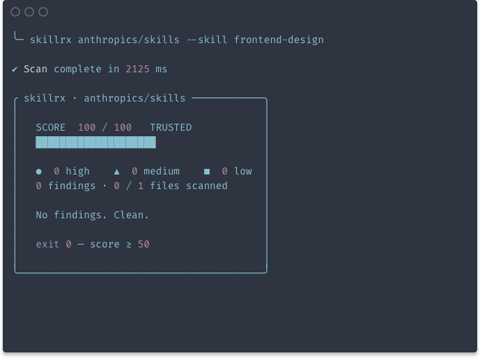
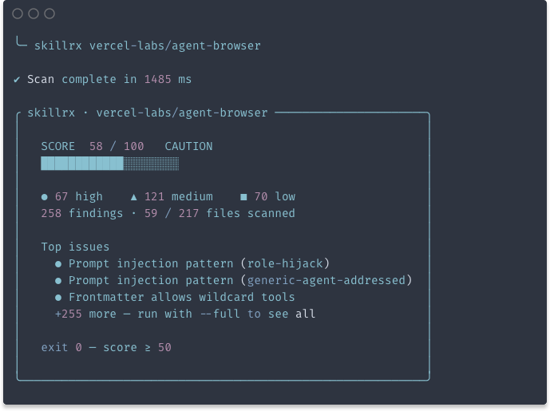

<p align="center">
  
  <br /><br />
  <a href="https://www.npmjs.com/package/skillrx"></a>
</p>

# skillRx

Security scanner for AI agent **skills and plugins**. Reviews the code before you install it.

## Usage

```bash
npx skillrx owner/repo
```

That's it. skillrx clones the repo, analyzes it, and gives you a verdict: **TRUSTED**, **CAUTION**, **RISKY**, or **MALICIOUS**.

## What you can scan

- **Claude Code skills and plugins**
- **Codex skills and plugins**
- **Skills for 40+ other agents** (Cursor, Aider, Continue.dev, Vercel AI SDK, OpenAI Assistants, MCP, etc.)

If it ships as a skill or plugin, skillrx reads it.

## Two ways to scan

**Full repository** — point skillrx at a repo (or local folder). It scans the whole tree you give it (respecting filters and limits).

**Single skill in a monorepo** — for big skills collections (for example `anthropics/skills`), use `--skill <name>` so only `skills/<name>` is fetched with a sparse checkout instead of cloning everything.

```bash
npx skillrx anthropics/skills --skill frontend-design
```


<table>
  <tr>
    <td align="center" width="50%"><strong>Full repository</strong><br /><br /></td>
    <td align="center" width="50%"><strong>Single skill (<code>--skill</code>)</strong><br /><br /></td>
  </tr>
</table>


## What we look for


| Area                      | What it detects                                               |
| ------------------------- | ------------------------------------------------------------- |
| **Prompt injection**      | Attempts to hijack the agent's role or coerce its tools       |
| **Shadow features**       | What the README promises vs what the code actually does       |
| **Exfiltration**          | Odd endpoints, URL shorteners, hardcoded IPs, DNS exfil       |
| **Secrets**               | Exposed API keys, tokens, JWTs, private blocks                |
| **Dangerous permissions** | Destructive shell, persistence, privilege escalation          |
| **Post-install scripts**  | npm lifecycle hooks, `curl | sh`, risky `setup.py`, git hooks |


## How the score is calculated

Starts at **100**. Each finding subtracts points based on severity:

- High: **−25**
- Medium: **−10**
- Low: **−5**

If a **critical rule** fires (hardcoded secrets, reverse shells, install-time `curl | sh`, severe prompt injection), the result jumps straight to **MALICIOUS with score 0**.


| Range         | Verdict   |
| ------------- | --------- |
| 80–100        | TRUSTED   |
| 50–79         | CAUTION   |
| 0–49          | RISKY     |
| Critical rule | MALICIOUS |


## Useful flags

```bash
npx skillrx owner/repo --full   # show every finding
npx skillrx owner/repo --json   # JSON output
```

## No execution

skillrx **does not run** `npm install`, `node`, or `python` against the repo. It only reads files and applies patterns. Pure static analysis, 100% offline (except for the initial clone).

## License

MIT